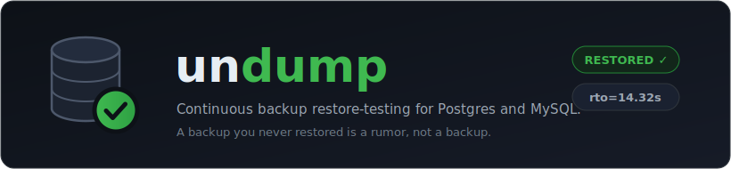
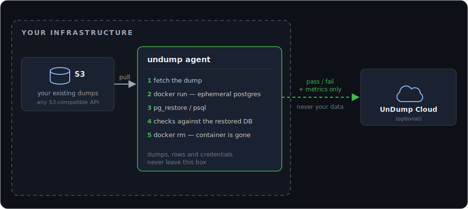

<p align="center">
  
</p>

<p align="center">
  <a href="https://github.com/UnDumpd/agent/actions/workflows/docker-build.yml"></a>
  
  
  <a href="LICENSE"></a>
</p>

Continuous **backup restore-testing** agent for Postgres and MySQL. Backups are everywhere; few teams find out they're broken until the day they actually need one. `undump` closes that gap by periodically pulling a real dump, restoring it into a throwaway container, and checking that the data is actually alive — all inside your own network.

Part of UnDump — this agent is the open-source half. The other half, UnDump Cloud, only ever receives `pass`/`fail` results and metrics, never your data.

<p align="center">
  
</p>

## Why

A backup job that "succeeds" can still be worthless: the dump truncates mid-write, a cron job silently produces a 0-byte file, the schema drifts and `pg_restore` breaks, or the source table was empty to begin with. All of these look fine from the outside — "the backup ran" — right up until the day you need to restore and it doesn't work. `undump` finds that out on a schedule, not during an incident.

## How it works

<p align="center">
  
</p>

Restore happens **in your infrastructure**. The agent never uploads the dump, row contents, or credentials anywhere — only the run result (status, RTO, check names) leaves the machine, and only if you configure a cloud endpoint at all.

## Quick start

```bash
docker pull postgres:18                    # restore container images; the agent doesn't pull them itself
docker pull mysql:8                        # only needed if you test MySQL backups
cp undump.example.yaml undump.yaml         # fill in your S3 source and (optionally) cloud endpoint
docker run --rm \
  -v /var/run/docker.sock:/var/run/docker.sock \
  -v "$(pwd)/undump.yaml:/app/undump.yaml" \
  -e S3_ACCESS_KEY=... -e S3_SECRET_KEY=... \
  ghcr.io/undumpd/agent check --config /app/undump.yaml
```

Or build it locally instead of pulling the published image:

```bash
docker build -t undump .
```

The agent needs `docker.sock` mounted — that's how it spins up and tears down the ephemeral database container it restores into.

## Config

Full reference: **[CONFIGURATION.md](CONFIGURATION.md)** — every field, `env:` secret references, prefix/glob source selection, check types, the cloud report payload, and exit-code semantics. A ready-to-copy example lives in [`undump.example.yaml`](undump.example.yaml). The short version:

```yaml
targets:
  - name: "prod-billing"
    engine: "postgres"
    schedule: "0 * * * *"
    source:
      type: "s3"
      uri: "s3://backups/billing/latest.dump"
      access_key: "env:S3_ACCESS_KEY"      # secrets are env references, never plaintext
      secret_key: "env:S3_SECRET_KEY"
    checks:
      - type: "rowcount"
        table: "invoices"
        max_drop_pct: 10.0
      - type: "freshness"
        table: "invoices"
        column: "created_at"
        max_age_hours: 24
```

## Status

Working today: `undump check --config ...` — a single pass over every target. It fetches the dump from S3, auto-detects the engine from the dump's content, restores it into an ephemeral `postgres:18` or `mysql:8` container (Postgres custom-format, Postgres plain-SQL, and `mysqldump` plain-SQL are all recognized), runs the `restore` check, guarantees container cleanup even on failure, and (if `cloud.endpoint` is set) reports the result over HTTP.

Not yet implemented:
- `rowcount` / `freshness` / `sql_assert` checks — parsed from config but not executed yet; only `restore` runs today.
- `undump run` — a daemon mode with per-target cron scheduling. For now, run `check` yourself (e.g. from your own cron/systemd timer).

## Development

Go isn't required on the host — the toolchain runs in a container:

```bash
bash hack/godev.sh test ./...
bash hack/godev.sh run ./cmd/undump check --config undump.example.yaml
bash hack/godev.sh run github.com/golangci/golangci-lint/v2/cmd/golangci-lint@v2.12.2 run ./...
```

## License

[Business Source License 1.1](LICENSE) — free to read, modify, and run, including in production. The only thing it restricts is reselling `undump` (or a derivative) as a competing hosted restore-testing service. Each release converts to Apache 2.0 four years after publication.
