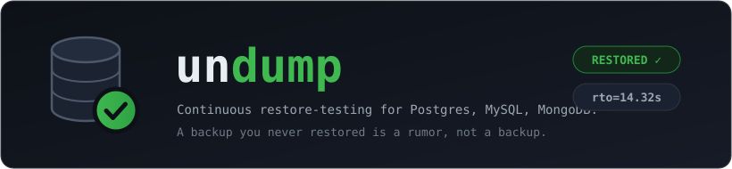
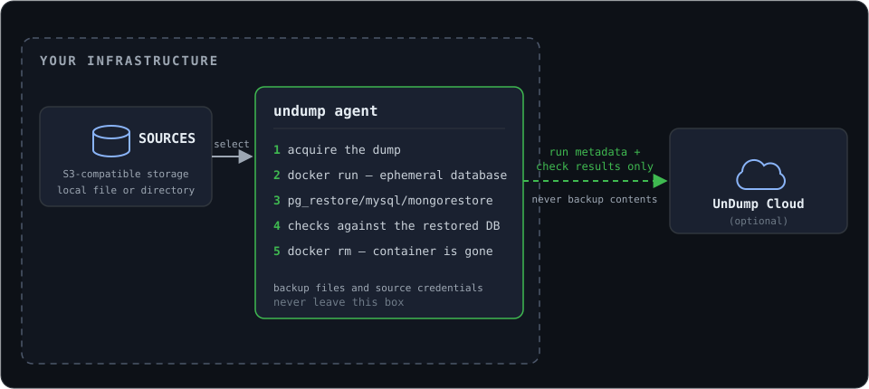

<p align="center">
  
</p>

<p align="center">
  <a href="https://undumpd.com"></a>
  <a href="https://dash.undumpd.com/?demo=1&lang=en&utm_source=github&utm_medium=readme"></a>
  <a href="https://github.com/UnDumpd/agent/actions/workflows/docker-build.yml"></a>
  
  
  <a href="LICENSE"></a>
</p>

Continuous **backup restore-testing** agent for Postgres, MySQL, and MongoDB. Backups are everywhere; few teams find out they're broken until the day they actually need one. `undump` closes that gap by periodically selecting a real dump from S3 or the local filesystem, restoring it into a throwaway container, and checking that the data is actually alive — all inside your own network.

Part of UnDump — this agent is the source-available half. The other half, UnDump Cloud, only ever receives run metadata and check results, never backup files, dump contents, or source credentials.

**[Live demo of the cloud dashboard](https://dash.undumpd.com/?demo=1&lang=en&utm_source=github&utm_medium=readme)** — three fake targets with real run history, no signup.

<p align="center">
  
</p>

## Why

A backup job that "succeeds" can still be worthless: the dump truncates mid-write, a cron job silently produces a 0-byte file, the schema drifts and `pg_restore` breaks, or the source table was empty to begin with. All of these look fine from the outside — "the backup ran" — right up until the day you need to restore and it doesn't work. `undump` finds that out on a schedule, not during an incident.

## How it works

<p align="center">
  
</p>

Restore happens **in your infrastructure**. The agent never uploads backup files, dump contents, or source credentials. If you configure a cloud API key, it reports run metadata and check results: target, engine, source URI (sanitized for local sources), agent version, timestamps, status, RTO, dump size, check results (including their values and details), and any error text.

## Quick start

```bash
cp undump.example.yaml undump.yaml         # fill in your sources and (optionally) a cloud API key
docker run --rm \
  -v /var/run/docker.sock:/var/run/docker.sock \
  -v "$(pwd)/undump.yaml:/app/undump.yaml" \
  -v /host/backups:/backups:ro \
  -e S3_ACCESS_KEY=... -e S3_SECRET_KEY=... \
  ghcr.io/undumpd/agent run --config /app/undump.yaml
```

That starts the long-running daemon: each target is checked on its own `schedule` (standard 5-field cron) until the container is stopped. For a single one-off pass instead — e.g. wired into your own cron/systemd timer — use `check` in place of `run`.

For local sources, the configured path is inside the agent container. The read-only mount above makes `/host/backups` available as `/backups`; point a local target at `/backups` or a file beneath it.

Cloud reporting is disabled in the example by default. To enable it, uncomment `cloud.api_key` in `undump.yaml` and add `-e UNDUMP_API_KEY=...` to the `docker run` command.

Or build it locally instead of pulling the published image:

```bash
docker build -t undump .
```

The agent needs `docker.sock` mounted — that's how it spins up and tears down the ephemeral database container it restores into. The restore images (`postgres:18` / `mysql:8` / `mongo:8`) are pulled automatically on first use; pre-pull them yourself only if you want to avoid the one-time download during the first check run.

## Config

Full reference: **[CONFIGURATION.md](CONFIGURATION.md)** — every field, `env:` secret references, local and S3 source selection, check types, the cloud report payload, and exit-code semantics. A ready-to-copy example lives in [`undump.example.yaml`](undump.example.yaml). A local directory target looks like this:

```yaml
targets:
  - name: "local-billing"
    engine: "postgres"
    schedule: "0 * * * *"
    source:
      type: "local"
      path: "/backups"
      pattern: "*.dump"
      min_age: "5m"
    checks:
      - type: "rowcount"
        table: "invoices"
        max_drop_pct: 10.0
```

MongoDB dumps are shaped differently: a `mongodump` collection directory is itself the dump, so point `path` straight at it, or give `uri` the S3 prefix holding the `*.bson`/`*.metadata.json` files. Either way the agent recognizes the shape from the files themselves and restores the whole thing — see [MongoDB dumps](CONFIGURATION.md#mongodb-dumps).

## Status

Both commands acquire the configured dump from S3 or the local filesystem, detect its format, and restore it into an ephemeral `postgres:18`, `mysql:8`, or `mongo:8` container. They run the implicit `restore` check followed by any configured `rowcount`, `freshness`, and `sql_assert` checks. The container is force-removed after the run, including failure paths. If `cloud.api_key` is set, the result is also reported over HTTP.

- `undump check --config ...` — a single pass over every target, then exit. Useful for a one-off run or when you'd rather drive scheduling yourself (cron, systemd timer, CI).
- `undump run --config ...` — a daemon: every target's `schedule` (standard 5-field cron, e.g. `"0 * * * *"`, or `"@every 1h"`) is loaded once at startup and run on its own timer until SIGINT/SIGTERM. A schedule is required on every target for `run` (it's optional and ignored by `check`). Shutdown waits for any restore already in flight to finish and clean up its container before the process exits. If a target's restore outlasts its own schedule, the next tick for that target is skipped rather than piling up concurrent restores.

Check semantics:
- `rowcount` — counts rows in `table`, or documents in the collection `table` names on MongoDB; fails when the count drops more than `max_drop_pct` (default 10%) against the last known good value. Without a previous value (first run of a target since the daemon started, or no cloud configured) it records a baseline and passes.
- `freshness` — fails when the newest `column` value in `table` is older than `max_age_hours`. The age is computed by the restored database itself — `EXTRACT(EPOCH ...)` on Postgres, `TIMESTAMPDIFF` on MySQL, a `$max` aggregation on MongoDB — so no timestamp-format guessing.
- `sql_assert` — runs `query` and compares the scalar result with `expect`. On Postgres and MySQL `query` is SQL; on MongoDB it's a bare `mongosh` expression such as `db.orders.countDocuments({status:"paid"})`. The scalar, expected value, and result detail are reported when cloud reporting is enabled, so return only a non-sensitive assertion value; never select emails, tokens, PII, or secrets.

`rowcount`'s delta base (`last_rowcount`) comes from the cloud's response to the previous report and is carried in memory between scheduled runs of the same target — this only accumulates under `run`. A restart of the daemon, or `check`'s one-shot invocations, always start from a fresh baseline.

## Development

Go isn't required on the host — the toolchain runs in a container:

```bash
bash hack/godev.sh test ./...
bash hack/godev.sh run ./cmd/undump check --config undump.example.yaml
bash hack/godev.sh run github.com/golangci/golangci-lint/v2/cmd/golangci-lint@v2.12.2 run ./...
```

## License

[Business Source License 1.1](LICENSE) — free to read, modify, and run, including in production. The only thing it restricts is reselling `undump` (or a derivative) as a competing hosted restore-testing service. Each release converts to Apache 2.0 four years after publication.
